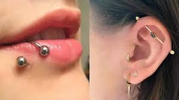

<!DOCTYPE html>
<html lang="es">
<head>
    <meta charset="UTF-8">
    <meta name="viewport" content="width=device-width, initial-scale=1.0">
    <title>SAC-RD | Tatuajes y Piercings</title>
    
</head>
<body>
    

        <h2>SAC-RD</h2>
        <a href="#inicio">Inicio</a>
        <a href="#servicios">Servicios</a>
        <a href="#galeria">Galería</a>
        <a href="#contacto">Contacto</a>
        <a href="#acerca-de-nosotros">Acerca de Nosotros</a>
    

    

        <header id="inicio">
            <h1>SAC-RD | Tatuajes y Piercings</h1>
            
Arte corporal con pasión y profesionalismo en México.

            
            

        </header>

        <section id="servicios">
            <h2>Nuestros Servicios</h2>
            

                

                    <h3>Tatuajes Personalizados</h3>
                    
Diseños únicos creados a tu gusto y estilo. Contamos con artistas expertos en diversos estilos.

                    

                        
                        
Descripción detallada de los tatuajes personalizados. Aquí se pueden incluir ejemplos, estilos o información adicional sobre el proceso de creación de los diseños.

                    

                    <button class="service-button" onclick="toggleDetails(this)">Ver imagen</button>
                

                

                    <h3>Piercings Profesionales</h3>
                    
Perforaciones seguras y estéticas realizadas con equipo esterilizado y joyería de alta calidad.

                    

                        
                        
Descripción detallada de los piercings profesionales. Aquí se pueden incluir detalles sobre los tipos de perforaciones disponibles y el cuidado posterior.

                    

                    <button class="service-button" onclick="toggleDetails(this)">Ver imagen</button>
                

                

                    <h3>Cover-Ups</h3>
                    
Transformamos tatuajes antiguos o no deseados en obras de arte nuevas y vibrantes.

                    

                        
                        
Descripción detallada sobre el proceso de Cover-Ups. Explicación de cómo se cubren tatuajes no deseados y cómo logramos transformar un diseño antiguo.

                    

                    <button class="service-button" onclick="toggleDetails(this)">Ver imagen</button>
                

                

                    <h3>Retoques y Mantenimiento</h3>
                    
Servicios para mantener tus tatuajes y piercings en perfectas condiciones a lo largo del tiempo.

                    

                        
                        
Información sobre los retoques y cómo los tatuajes y piercings deben mantenerse con el paso del tiempo.

                    

                    <button class="service-button" onclick="toggleDetails(this)">Ver imagen</button>
                

            

        </section>

        <section id="galeria">
            <h2>Galería</h2>
            

                
                
                
                
                
                
                
                
                
                
                
                
            

        </section>

        <section id="contacto">

             <h2>Contacto</h2>
            
             

            
             
¡Estamos listos para plasmar tu arte! Contáctanos para agendar tu cita o resolver tus dudas.

            
             <form action="https://formspree.io/f/YOUR_UNIQUE_CODE" method="post"></form>
            
             
</form>
            
             <label for="nombre">Nombre:</label></form>
            
             <input type="text" id="nombre" name="nombre" required></form>
            
             
</form>
            
             
</form>
            
             <label for="email">Email:</label></form>
            
             <input type="email" id="email" name="email" required></form>
            
             
</form>
            
             
</form>
            
             <label for="mensaje">Mensaje:</label></form>
            
             <textarea id="mensaje" name="mensaje" rows="5" required></textarea></form>
            
             
</form>
            
             <button type="submit" class="submit-button">Enviar Mensaje</button></form>
            
             </form></form>
            
             

            
             </section>

             <section id="acerca-de-nosotros">
                <h2>Acerca de Nosotros</h2>
                

                    
En SAC-RD, nuestra historia comenzó con una profunda pasión por el arte corporal y la autoexpresión. Fundado por un grupo de artistas y entusiastas del tatuaje y el piercing, nuestro estudio nació del deseo de crear un espacio donde la creatividad floreciera en un ambiente seguro, profesional y acogedor en el corazón de México.

                    
Vimos la necesidad de un lugar que no solo ofreciera servicios de alta calidad, sino que también entendiera la importancia de cada marca en la piel como una historia personal. Creemos que cada tatuaje y cada piercing es una forma única de arte, una declaración de identidad y un recuerdo imborrable. Por eso, nos dedicamos a escuchar a nuestros clientes, a comprender sus visiones y a trabajar en colaboración para hacerlas realidad.

                    
Nuestro compromiso va más allá de la aguja y la tinta. Nos esforzamos por mantener los más altos estándares de higiene y seguridad, utilizando equipos esterilizados y siguiendo rigurosas prácticas sanitarias. Nuestro equipo está formado por artistas talentosos y experimentados, cada uno con su propio estilo distintivo, listos para ofrecerte desde diseños personalizados hasta los estilos más clásicos.

                    
En SAC-RD, no solo te ofrecemos un servicio, te brindamos una experiencia artística completa. Estamos orgullosos de ser parte de tu viaje de autoexpresión y esperamos poder ayudarte a contar tu historia a través del arte corporal.
     
                    <button class="service-button" onclick="toggleDetails(this)">Ver mas</button>

                

            </section>
    
            
             

            
            
            
             <footer>
            
             
&copy; 2025 SAC-RD | Tatuajes y Piercings

            
             </footer>
            
            
            
             
            
            </body>
            
            </html>
